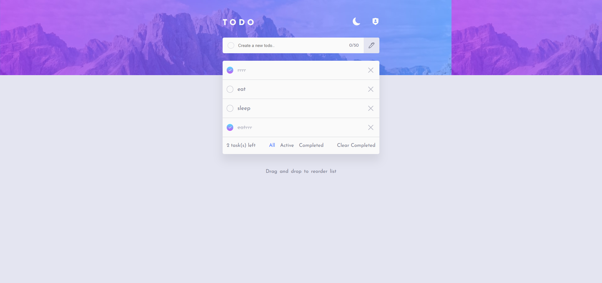

# Frontend Mentor - Todo app solution

This is a solution to the [Todo app challenge on Frontend Mentor](https://www.frontendmentor.io/challenges/todo-app-Su1_KokOW). Frontend Mentor challenges help you improve your coding skills by building realistic projects. 

## Table of contents

- [Frontend Mentor - Todo app solution](#frontend-mentor---todo-app-solution)
  - [Table of contents](#table-of-contents)
  - [Overview](#overview)
    - [The challenge](#the-challenge)
    - [Screenshot](#screenshot)
    - [Links](#links)
  - [My process](#my-process)
    - [Built with](#built-with)
    - [What I learned](#what-i-learned)
      - [i had alot of problems in implementing the XP/ranking system but i finally came up with this](#i-had-alot-of-problems-in-implementing-the-xpranking-system-but-i-finally-came-up-with-this)
    - [Continued development](#continued-development)
  - [Author](#author)

**Note: Delete this note and update the table of contents based on what sections you keep.**

## Overview

### The challenge

Users should be able to:

- View the optimal layout for the app depending on their device's screen size
- See hover states for all interactive elements on the page
- Add new todos to the list
- Mark todos as complete
- Delete todos from the list
- Filter by all/active/complete todos
- Clear all completed todos
- Toggle light and dark mode
- **Bonus**: Drag and drop to reorder items on the list

### Screenshot



Add a screenshot of your solution. The easiest way to do this is to use Firefox to view your project, right-click the page and select "Take a Screenshot". You can choose either a full-height screenshot or a cropped one based on how long the page is. If it's very long, it might be best to crop it.

Alternatively, you can use a tool like [FireShot](https://getfireshot.com/) to take the screenshot. FireShot has a free option, so you don't need to purchase it. 

Then crop/optimize/edit your image however you like, add it to your project, and update the file path in the image above.

**Note: Delete this note and the paragraphs above when you add your screenshot. If you prefer not to add a screenshot, feel free to remove this entire section.**

### Links

- Solution URL: [Add solution URL here](https://your-solution-url.com)
- Live Site URL: [Add live site URL here](https://your-live-site-url.com)

## My process

### Built with

- Semantic HTML5 markup
- SCSS for styles
- Firebase for backend
- Mobile-first workflow
- [React](https://reactjs.org/) - JS library

**Note: These are just examples. Delete this note and replace the list above with your own choices**

### What I learned

I came across some road blocks while building this project especially the firebase part, nevertheless i learnt how to...
- auth a user
- store a user in firestore 
- create sub collections
- in general i learnt how to create a user and also get live snapshots of the user's activities


#### i had alot of problems in implementing the XP/ranking system but i finally came up with this
This function fires when the user's xp satisfies a condition but checks if that item exits before it fires
if it exits, the function returns

```js
  useEffect(() => {
   const action = async (id, message, img) => {
      const unlock = doc(collection(db, `users/${userId}/awards`))
      const exist = awards && awards.find((itm) => itm.id === id)
      if (exist) return
      await setDoc(unlock, {
        id,
        unlockable: message,
        img,
      })
    }
    }, [xp, userId, awards])

     if (xp >= 10)
      action(
        0,
        'private',
        'https://i.ibb.co/sjSp8Tf/E2-private-second-class.png'
      )
```

### Continued development
This project can be refactored to be a note app later with added features

## Author

- Website - [Add your name here](https://www.your-site.com)
- Frontend Mentor - [@yourusername](https://www.frontendmentor.io/profile/yourusername)
- Twitter - [@yourusername](https://www.twitter.com/yourusername)
